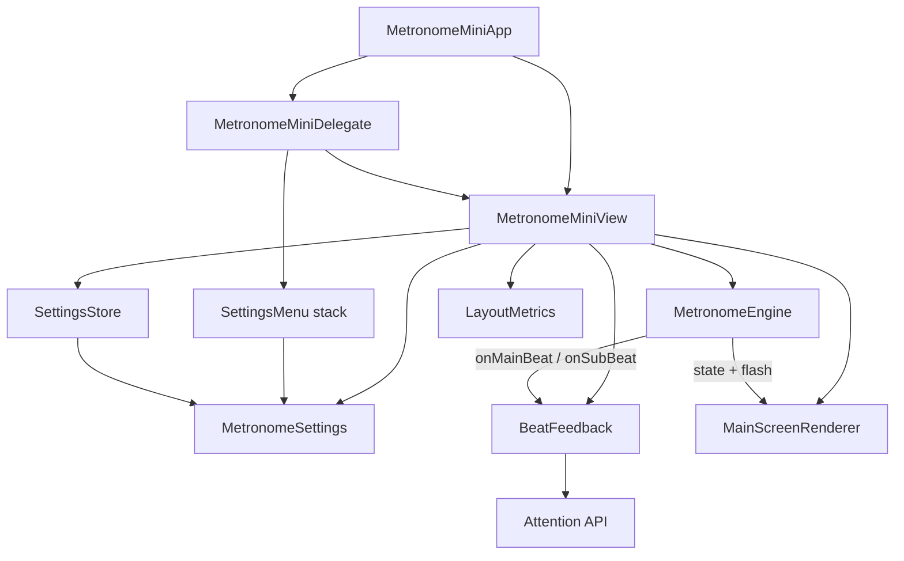

# MetronomeMini Production-Ready Architecture Refactor

## Current state

The app is a flat 4-file Connect IQ project (~820 lines). Almost all domain logic lives in [`source/MetronomeMiniView.mc`](source/MetronomeMiniView.mc):

- UI rendering (~115 lines in `onUpdate`)
- Timer / beat counting
- Sound + vibration profiles
- Settings state + `Application.Storage` persistence
- 15+ getter/setter methods consumed by settings menus

The settings layer in [`source/SettingsMenuDelegate.mc`](source/SettingsMenuDelegate.mc) is the most modular part today (`OptionMenu` pattern), but it is tightly coupled to `MetronomeMiniView` and grows via `if/else` chains in `OptionMenuDelegate`.

**Production gaps found:**
- Empty lifecycle hooks: `onHide`, `onShow`, `MetronomeMiniApp.onStop` — timers/audio can leak when leaving the app
- Duplicated layout math (`22%` tap zone in both view draw and `getTapZoneWidth()`)
- Magic numbers for sound modes (`{0,1,4,2,3}`), tone freqs, layout percentages
- Hardcoded UI strings (only `AppName` in [`resources/strings/strings.xml`](resources/strings/strings.xml))
- README drift (vibe strength 60% vs code 50%; device list vs ~140 products in manifest)
- No compile CI; [`run_on_sim.sh`](run_on_sim.sh) hardcodes SDK path
- Dead code: `getApp()`, `isSoundEnabled()` (unused)

## Target architecture



### Layer responsibilities

| Layer | New file(s) | Responsibility |
|-------|-------------|----------------|
| **Constants** | `source/constants/MetronomeConstants.mc` | BPM limits, storage keys, layout ratios, beat-flash duration, sound-mode IDs |
| **Model** | `source/model/MetronomeSettings.mc`, `source/model/SubdivisionInfo.mc`, `source/model/SoundModeInfo.mc` | Typed settings + validation/clamping + display labels; subdivision metadata (count, name, icon ref) |
| **Persistence** | `source/persistence/SettingsStore.mc` | Load/save with schema version + defaults; single place for migration |
| **Engine** | `source/engine/MetronomeEngine.mc`, `source/engine/MetronomeEngineListener.mc` | Timer at subdivision resolution; beat/bar counting; start/stop/pause/resume; no UI or storage |
| **Feedback** | `source/feedback/BeatFeedback.mc` | Vibration + tone profiles for downbeat / main beat / subdivision tick; capability checks |
| **UI layout** | `source/ui/LayoutMetrics.mc` | Compute all screen-relative positions once per frame |
| **UI render** | `source/ui/MainScreenRenderer.mc` | Pure drawing from a snapshot struct (no timer logic) |
| **Settings UI** | Split `SettingsMenuDelegate.mc` into `source/settings/*.mc` | Menus + generic option registry (no view-specific if/else growth) |
| **Coordinator** | Slim [`source/MetronomeMiniView.mc`](source/MetronomeMiniView.mc) | Wire layers, implement `MetronomeEngineListener`, expose narrow API to delegate/menus |
| **Input** | [`source/MetronomeMiniDelegate.mc`](source/MetronomeMiniDelegate.mc) | Unchanged behavior; calls view action methods only |

## Subdivision-ready engine design

Subdivisions are a first-class engine concern, not a view concern.

**Tick model:** one repeating timer at `beatIntervalMs / subdivisionsPerBeat`.

```
beatIntervalMs = 60000 / bpm
tickIntervalMs = beatIntervalMs / subdivisionsPerBeat   // 1, 2, or 3
```

On each tick:
- If `tickIndex % subdivisionsPerBeat == 0` → **main beat** (accent logic uses `beatIndex` and `beatsPerBar`)
- Else → **subdivision tick** (lighter flash/sound/vibe)

`SubdivisionInfo.mc` defines the three modes you were already sketching (quarter=1, eighth=2, triplet=3) with label + drawable id (`note_quarter`, `note_eighth`, `note_triplet` — add to [`resources/drawables/drawables.xml`](resources/drawables/drawables.xml)).

**Feedback differentiation (configurable constants):**
- Downbeat: current strong accent
- Main beat (non-downbeat): current regular accent
- Subdivision: shorter/lighter tone, lower vibe strength, optional subtle gray flash (or no flash — pick one and document)

Changing subdivision or BPM while running calls `engine.restart()` (same as today's `restartTimer()`).

## Key extractions from the god class

### 1. `MetronomeSettings` replaces inline fields + getters

Consolidate all persisted fields:

```monkeyc
// MetronomeSettings.mc — illustrative
var bpm, beatsPerBar, subdivision, soundMode, vibrationEnabled,
    vibeStrength, vibePulse, timeMode

function clamp() { /* MIN/MAX, 1..16 BPB, valid subdivision */ }
function getTempoLabel() { /* move from view */ }
function getSoundModeName() / getTimeModeName() / getSubdivisionName()
```

View/settings menus read/write `_settings` instead of 15 view methods.

### 2. `SettingsStore` replaces `loadSettings` / `saveSettings`

- Storage keys defined once in `MetronomeConstants`
- Add `"settingsVersion"` key (start at `1`) for forward-compatible migrations
- `load()` returns clamped `MetronomeSettings`; `save(settings)` writes atomically
- Invalid/corrupt values fall back to defaults (never crash on bad storage)

### 3. `BeatFeedback` replaces `doVibrate` (~50 lines)

Move tone profile tables into `SoundModeInfo.mc` (freq/duration arrays per mode + downbeat flag). `BeatFeedback.play(eventType)` handles `Attention has :vibrate` / `:ToneProfile` / fallback `TONE_LOUD_BEEP`.

### 4. `MainScreenRenderer` + `LayoutMetrics` replace `onUpdate` body

`LayoutMetrics.from(dc)` returns positions + tap zone width (single source of truth — fixes DRY violation with delegate).

`MainScreenRenderer.draw(dc, layout, snapshot)` where `snapshot` is a plain struct:

```monkeyc
{ :bpm, :tempoLabel, :subLabel, :isRunning, :showBeat, :isDownbeat,
  :displayBeat, :beatsPerBar, :subdivisionIcon }
```

### 5. Settings menu registry (Open/Closed for new options)

Replace `OptionMenuDelegate` if/else chain with a descriptor table:

```monkeyc
// Each entry: :id, :title, :labels, :values, :applyFn, :subLabelFn
```

Adding **Subdivision** becomes one registry entry + `SubdivisionInfo` — no new delegate class.

Split [`source/SettingsMenuDelegate.mc`](source/SettingsMenuDelegate.mc) into:
- `SettingsMenu.mc`
- `SettingsMenuDelegate.mc`
- `OptionMenu.mc` / `OptionMenuDelegate.mc`
- `SettingDescriptors.mc` (registry)

## Slim coordinator view

[`source/MetronomeMiniView.mc`](source/MetronomeMiniView.mc) becomes ~120–150 lines:

- Owns `_settings`, `_engine`, `_feedback`, `_renderer`
- `initialize()` → `SettingsStore.load()`, construct engine/feedback
- Implements `MetronomeEngineListener` → update flash state, call `_feedback`, `WatchUi.requestUpdate()`
- Public actions: `toggleMetronome()`, `increaseBpm()`, `decreaseBpm()`, `pauseForSettings()`, `resumeFromSettings()`, `getSettings()`, layout accessors
- `onUpdate()` → build snapshot, `_renderer.draw(...)`
- `onHide()` → `engine.stop()`; `onShow()` → no-op or restore if needed

[`source/MetronomeMiniDelegate.mc`](source/MetronomeMiniDelegate.mc) uses `view.getLayoutMetrics()` or `getTapZoneWidth()` from shared `LayoutMetrics` (no duplicated `22%`).

## Production hardening (same pass)

### Lifecycle safety
- [`source/MetronomeMiniApp.mc`](source/MetronomeMiniApp.mc) `onStop()` → notify view/engine to stop timers
- `MetronomeEngine.stop()` always nulls both tick and flash timers (today's cleanup is good but not invoked on app exit)
- `pauseForSettings()` / `resumeFromSettings()` delegate to engine pause/resume

### Strings and assets
- Move user-visible labels to [`resources/strings/strings.xml`](resources/strings/strings.xml) (settings titles, tempo names optional, subdivision names)
- Register subdivision SVG drawables in [`resources/drawables/drawables.xml`](resources/drawables/drawables.xml)
- Draw subdivision icon near BPM or beats/bar indicator when `subdivision > 1`

### Build and docs
- **Out of scope:** [`run_on_sim.sh`](run_on_sim.sh) — leave unchanged per user request
- Optional: `.github/workflows/build.yml` — `monkeyc` compile against 2–3 representative devices if SDK available in CI
- Sync [`README.md`](README.md) with actual vibe strengths, sound mode names, subdivision setting, and point to manifest for full device list

### Cleanup
- Remove unused `getApp()` and `isSoundEnabled()` (or wire `isSoundEnabled` into feedback if useful)
- Add `// (:background)` on `MetronomeEngine` + `BeatFeedback` if timer callbacks need background annotation (verify per SDK guide during implementation)

## File layout after refactor

```
source/
  MetronomeMiniApp.mc
  MetronomeMiniView.mc          # thin coordinator (~150 lines)
  MetronomeMiniDelegate.mc
  constants/MetronomeConstants.mc
  model/MetronomeSettings.mc
  model/SubdivisionInfo.mc
  model/SoundModeInfo.mc
  persistence/SettingsStore.mc
  engine/MetronomeEngine.mc
  engine/MetronomeEngineListener.mc
  feedback/BeatFeedback.mc
  ui/LayoutMetrics.mc
  ui/MainScreenRenderer.mc
  settings/SettingsMenu.mc
  settings/SettingsMenuDelegate.mc
  settings/OptionMenu.mc
  settings/SettingDescriptors.mc
resources/
  strings/strings.xml           # expanded
  drawables/                    # + note_quarter/eighth/triplet
```

## Implementation order

Work top-down so the app compiles after each milestone:

1. **Constants + model + store** — no behavior change yet; view reads settings object
2. **Engine + listener + feedback** — move timer/beat/audio out of view; verify identical behavior at subdivision=1
3. **UI extraction** — renderer + layout metrics; verify visual parity on simulator
4. **Settings registry + file split** — DRY menus; add subdivision setting
5. **Subdivision feature** — engine ticks, feedback tiers, icon on main screen
6. **Lifecycle + strings + README** — production pass (no `run_on_sim.sh` changes)
7. **Manual test matrix** — vivoactive4 (default), one round watch, one Instinct/low-memory device

## Manual test plan

- BPM adjust while stopped and while running (timer restarts correctly)
- All sound modes on device/simulator with and without `ToneProfile` support
- Vibration on/off, strength/pulse changes
- Beats/bar 1 vs 4 — downbeat accent correct
- Subdivision 1/2/3 — correct tick rate, main vs sub accents distinguishable
- Open settings → metronome pauses; back → resumes if was running
- Leave app (`onStop`) while running → no lingering vibration/tone
- Kill/relaunch app → settings persisted including new `subdivision` key
- Storage corruption test → defaults used, no crash

## Risk notes

- **Connect IQ has no standard unit-test setup in this repo** — correctness relies on extracted pure model logic (easy to reason about) + simulator manual matrix. Avoid adding a test harness unless you want a separate `tests/` barrel project later.
- **Subdivision timing at high BPM** — at 250 BPM with triplets, tick interval ≈ 80ms; verify on low-memory devices for timer jitter; clamp or document minimum practical interval if needed.
- **Comprehensive refactor touches every file** — keep subdivision=1 behavior identical first, then layer subdivision feature to bisect regressions.

## Success criteria

- `MetronomeMiniView.mc` under ~200 lines; no direct `Application.Storage` or `Attention` calls
- Single source for layout %, storage keys, sound profiles
- Subdivision setting works end-to-end (persistence, menu, engine, UI icon)
- Lifecycle stops all timers on hide/stop
- README and strings match runtime behavior
- `monkeyc` build succeeds on representative devices
